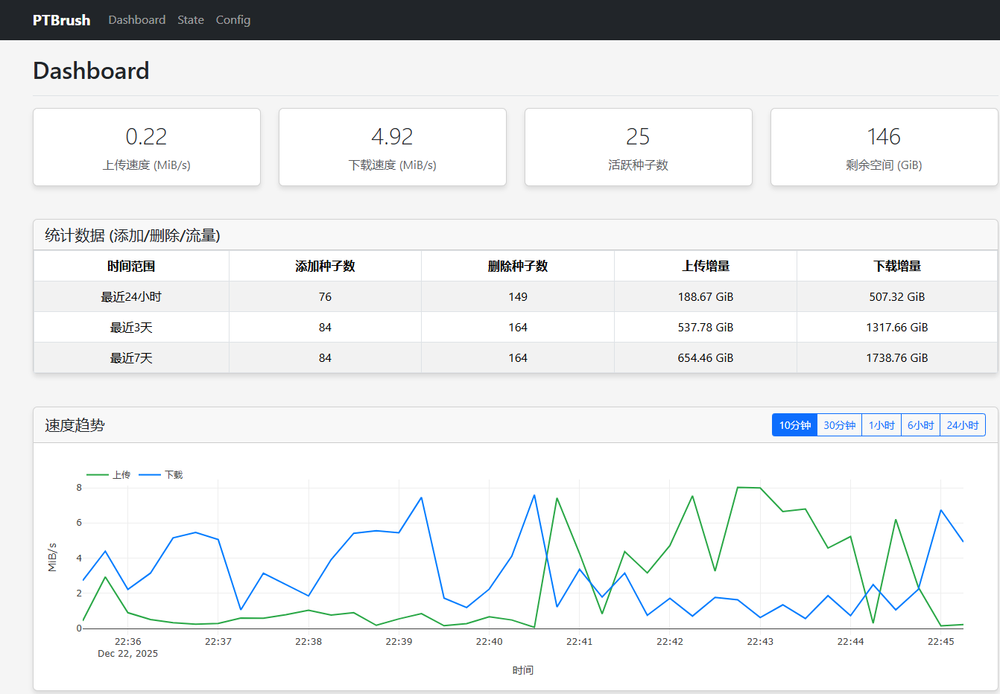

# PTBrush - PT全自动刷流工具 🚀

PTBrush是一款专注于PT站点刷流的全自动工具，让你的QBittorrent下载器24小时不间断全速上传！受`ptool`启发，用Python实现，目前支持`M-Team`站点。

在原版的基础上添加了以下内容：

- 更换包管理器为 [uv](https://docs.astral.sh/uv/)
- 移除拆包逻辑
- 修改网页为dashboard、state和config三个页面
- 统计界面添加24h、3d、7d的统计
- state界面添加种子数量显示和日志显示，方便debug
- config界面可快速修改配置
- 对种子数量限制由只限制同时下载数量改为所有ptbrush分类的数量
- 扫描不活动种子时会自动ptbrush分类下删除所有错误和等待的种子
- 添加API Endpoint ：`/api/dashboard/data`
- 已知bug：如果TOML里没有某项配置，config界面修改该项配置不会保存

## 这是什么？🤔

简单来说，PTBrush是一个能帮你在PT站点自动刷流量的工具。它会：

- 自动从PT站点抓取Free种子 📥
- 智能添加种子到QBittorrent进行下载和做种 🌱
- 智能清理长时间无活跃的种子，优化磁盘空间 🧹
- 提供Web界面实时监控刷流状态 📊

## 为什么需要它？💡

- 想要在PT站点提高分享率但没时间手动操作？
- 希望24小时保持上传速度但不知道如何优化？
- 厌倦了手动添加、删除种子的繁琐过程？

PTBrush就是为解决这些问题而生的！它能根据你的网络状况和磁盘空间智能调整刷流策略，让你的上传速度始终保持在理想状态。

## 使用方法 📝

1. 修改配置

   将`config.toml.example`复制一份，参见注释修改`config.toml.example`，然后重命名为`config.toml`，并移动到你的data文件夹内，然后你可以使用以下两种方式运行

2. docker run

   复制以下命令，并修改data文件夹路径，确保文件夹内有你已经修改好的`config.toml`，之后回车即可运行

   ⚠️：请按照你的实际情况修改`/your-config-path`、`PUID`和`PGID`

   ```bash
   docker run -d \
     --name ptbrush \
     --restart unless-stopped \
     -p 8000:8000 \
     -v /your-config-path/data:/app/data \
     -e PUID=1000 \
     -e PGID=1000 \
     -e UMASK=022 \
     -e TZ=Asia/Shanghai \
     ghcr.io/pininkara/ptbrush:latest
   ```

3. 本地运行

   你需要先安装Python和 [uv](https://docs.astral.sh/uv/)，然后clone项目并打开

   ```bash
   git clone https://github.com/pininkara/ptbrush
   cd ptbrsh
   ```

   创建data目录

   ```bash
   mkdir data
   # 然后把你的config.toml放进data目录
   ```

   之后建立虚拟环境并同步依赖

   ```bash
   uv venv
   uv sync
   ```

   然后就可以运行了

   ```bash
   uv run ptbrush/main.py
   ```

运行截图：



## 刷流原理 🧠

程序工作流程：

1. 定期检查PT站点新发布的免费种子，加入种子列表
2. 定期检查qBittorrent，套用删除逻辑并删除种子
3. 如果当前种子数量小于最大种子数量，并且添加种子后硬盘剩余容量还大于最小容量，就从种子列表获取最新的种子发送给qBittorrent下载

### 刷流模块

涉及三个对种子的操作：新增、删除、拆分。

1. **新增种子逻辑**

   - 每当删除种子时会自动添加种子
   - 每次扫描qBittorrent时如果种子数量为满会添加种子
   
2. **删除种子逻辑**

   满足以下任一条件的种子会被删除：
   - 种子临近Free结束时间（默认1小时内）
   - 已完成的种子长时间无活跃（无上传也无下载）
   - 错误和等待的种子

3. **种子拆分规则**

   ~~对于大包种子，PTBrush会智能拆分，只下载部分文件，快速进入做种状态，提高刷流效率。~~已删除相关逻辑

## 注意事项 ⚠️

- 首次启动后，请查看Web界面确认配置是否生效。
- 如果长时间没有刷流活动，请检查日志文件了解原因。

## 常见问题 ❓

**Q: 为什么我的上传速度一直上不去？**  
A: 原因比较多，排查一下以下几种情况：

   1. `expect_upload_speed`设置过高，导致一上传速度上不去就一直下载种子，进入死循环，建议设置上传带宽的一般就够了，比如30Mbps带宽，可以设置为`1.875MiB/s`
   2. 没有公网IP，或者有公网IP但没有进行qb端口映射
   3. 如果没有公网IP，可以尝试开通IPV6，并放行相应端口


**Q: 磁盘空间会被占满吗？**  
A: 不会，PTBrush会根据`min_disk_space`设置保留足够的磁盘空间，当空间不足时会停止添加新种子。

**Q: 如何获取M-Team的API令牌？**  
A: 登录M-Team网站，在控制台-实验室中找到存取令牌，生成并复制令牌。

---

希望PTBrush能帮你轻松刷流，提高分享率！如有问题，欢迎提交issue。祝你刷流愉快！🎉
